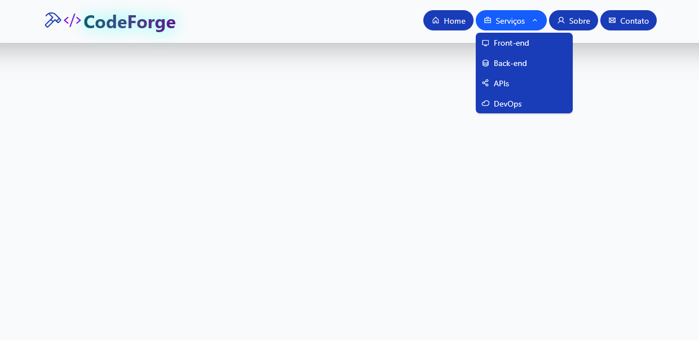

# 💻 CodeForge

Bem-vindo ao **CodeForge**, um projeto desenvolvido por **Pedro Miranda**.  
Este projeto tem como foco o design de um **menu responsivo moderno**, elegante e interativo — ideal para páginas institucionais, portfólios ou sistemas web.

---
## 🖼️ Preview do Projeto

### 💻 



---


## 🚀 Tecnologias Utilizadas

- **HTML5**
- **TailwindCSS** (via CDN)
- **Phosphor Icons**
- **CSS Modularizado**
  - `variables.css`  
  - `reset.css`  
  - `typography.css`  
  - `layout.css`  
  - `header.css`  
  - `navigation.css`  
  - `submenu.css`  
  - `buttons.css`  
  - `mobile.css`  
  - `animations.css`  
  - `utilities.css`

---

## 🧠 Estrutura do Projeto

/
├── index.html
├── base/
│ ├── main.css
│ ├── variables.css
│ ├── reset.css
│ ├── typography.css
│ ├── layout.css
│ ├── header.css
│ ├── navigation.css
│ ├── submenu.css
│ ├── buttons.css
│ ├── mobile.css
│ ├── animations.css
│ └── utilities.css
└── README.md


---

## 🌐 Funcionalidades

✅ Menu de navegação com dropdown animado  
✅ Ícones dinâmicos usando **Phosphor Icons**  
✅ Layout **responsivo e leve**, otimizado com **TailwindCSS**  
✅ Transições suaves e design clean  
✅ Estrutura de CSS modular e escalável  

---


---

## 🧩 Exemplo de Uso

Para testar o projeto localmente:

```bash
# 1. Clone o repositório
git clone https://github.com/seuusuario/codeforge.git

# 2. Acesse a pasta
cd codeforge

# 3. Abra o arquivo no navegador
start index.html


## 👨‍💻 Desenvolvedor

<div align="center">
  
  <br><br>
  
  **Desenvolvido por [Pedro Miranda](https://github.com/SEU-USERNAME)**<br>
   [](https://github.com/pedro2506)<br>
  [](https://www.linkedin.com/in/pedro-miranda-510471b4/)<br>
📧 Email: t3pedropaulo@gmail.com<br>
💬 Projeto criado com fins educacionais e para portfólio.<br>
📅 Criado em **Novembro de 2025**  

